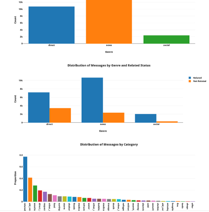

# === [Disaster Response Pipeline Project] ===

# === INSTALLATION ===
The code contained in this repository was written in HTML and Python 3, and requires the following Python packages: json, plotly, pandas, nltk, flask, sklearn, sqlalchemy, sys, numpy, re, pickle, warnings.
Use pip3 or pip depending of you python version
>pip3 install pandas
>pip3 install plotly
>pip3 install gunicorn

>pip3 install nltk
>pip3 install sqlalchemy

>pip3 install flask
>pip3 install joblib 

# === PROJECT ===
The goal of this project is create a Pipeline that classifier messages from disaster around the world. The messages are reviewed by differents origins ways are collected in a files csv given from Figure 8 company.
The Pipeline is going to read, transform and load the data for one side and the next step is treat all this information to classifier the message in 36 differents categories.

## 1. ETL PIPELINE PROJECT 
File -> process_data.py 
Contains a script with Data cleaning pipeline that:
    * Loads the messages and categories datasets
    * Merges the two datasets
    * Cleans the data
    * Stores it in a SQLite database

## 2. ML Pipeline 
File -> train_classifier.py
Contains a script with machine learning pipeline that:
    * Loads data from the SQLite database
    * Splits the dataset into training and test sets
    * Builds a text processing and machine learning pipeline
    * Trains and tunes a model using GridSearchCV
    * Outputs results on the test set
    * Exports the final model as a pickle file
## 3. Flask Web App

Show the results in a Flask web app using html, css, javascript. Get the info from sqlalchemy

# === FILE STRUCTURE ===

- app
| - template
| |- master.html  # main page of web app
| |- go.html  # classification result page of web app
|- run.py  # Flask file that runs app

- data
|- disaster_categories.csv  #  categories data to process 
|- disaster_messages.csv  # messages ata to process
|- process_data.py
|- InsertDatabaseName.db   # database to save clean data to

- models
|- train_classifier.py
|- classifier.pkl  # saved model 

- README.md

# === RUN INSTRUCCIONS ===
## Running ETL pipeline that cleans data and stores in database

 > python data/process_data.py data/disaster_messages.csv data/disaster_categories.csv data/DisasterResponse.db
 
## Running ML pipeline that trains classifier and saves

  > python models/train_classifier.py data/DisasterResponse.db models/classifier.pkl

## Running the Web App from the Project Workspace IDE

Go to app´s directory and run 
    > python run.py
GO homepage http://0.0.0.0:3001/

 Run the following command in the app's directory to run your web app.
    >python run.py`

# === RESULTS ===
    
 precision    recall  f1-score   support

                 offer       0.00      0.00      0.00        26
           aid_related       0.75      0.65      0.70      2128
          medical_help       0.57      0.29      0.38       407
      medical_products       0.59      0.35      0.44       252
     search_and_rescue       0.47      0.18      0.26       146
              security       0.22      0.05      0.08        97
              military       0.56      0.38      0.45       162
                 water       0.70      0.62      0.66       311
                  food       0.79      0.68      0.73       558
               shelter       0.73      0.56      0.63       447
              clothing       0.62      0.40      0.48        73
                 money       0.51      0.29      0.37       124
        missing_people       0.23      0.08      0.12        64
              refugees       0.51      0.32      0.40       154
                 death       0.71      0.47      0.56       234
             other_aid       0.43      0.14      0.21       677
infrastructure_related       0.33      0.11      0.16       344
             transport       0.75      0.25      0.37       260
             buildings       0.69      0.47      0.55       266
           electricity       0.54      0.28      0.37       106
                 tools       0.07      0.03      0.04        33
             hospitals       0.25      0.12      0.16        50
                 shops       0.20      0.06      0.09        18
           aid_centers       0.30      0.10      0.15        58
  other_infrastructure       0.29      0.08      0.13       243
       weather_related       0.85      0.68      0.76      1463
                floods       0.83      0.53      0.65       419
                 storm       0.70      0.55      0.61       482
                  fire       0.26      0.10      0.15        49
            earthquake       0.88      0.83      0.85       487
                  cold       0.64      0.32      0.43       112
         other_weather       0.48      0.18      0.26       292
         direct_report       0.68      0.43      0.53       964

           avg / total       0.67      0.48      0.55     11506

## Resources

https://plotly.com/python/discrete-color/
https://stackoverflow.com/questions/53970014/python-pickle-cannot-load-file-in-a-flask-webapp-attributeerror-model-main
